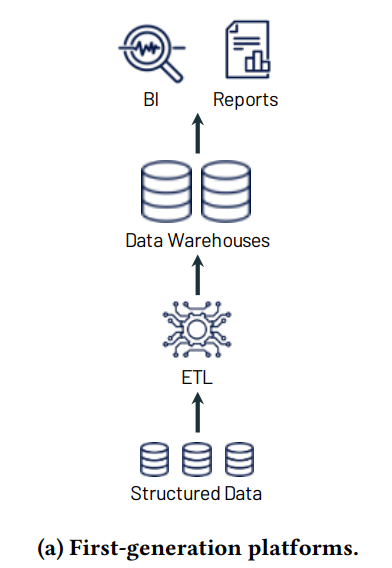
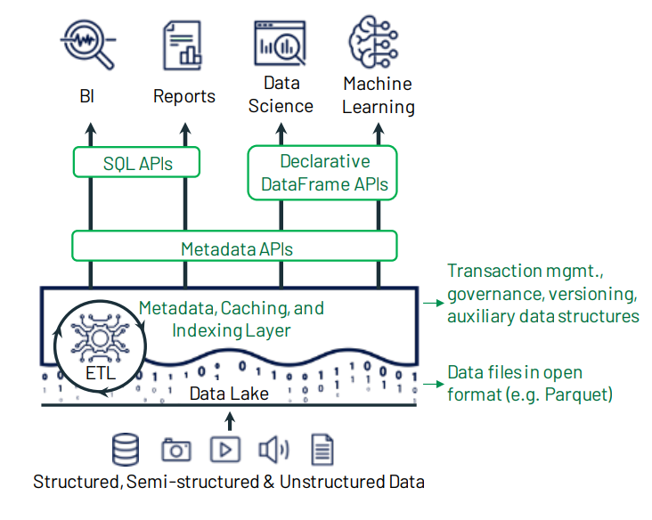

# Data Lakehouse Architecture

This is a very brief summary of the the data lakehouse architecture written from the perspective of the problems it addresses in previous strategical data frameworks. Its mostly based on the following article:

##### **Lakehouse: A New Generation of Open Platforms that Unify Data Warehousing and Advanced Analytics. Michael Armbrust1 , Ali Ghodsi1,2 , Reynold Xin1 , Matei Zaharia1,3 / 1Databricks, 2UC Berkeley, 3Stanford University**

## Data warehousing:
Data warehousing usually addresses the following core needs:
- help business planning and strategy
- allow easier/faster analytical insights 
- collecting data from operational databases into centralized warehouses
- decision support and business intelligence (BI)

## First generation systems: 
- coupled compute and storage 
- on-premises / heavy maintenance workload
- provision and pay for peak usage
- focus on structured data

## Second generation:
- Apache Hadoop movement
- all the raw data saved in data lakes
- low-cost storage systems
- data accessed via file APIs that allow horizontal scaling 
- data stored in generic and usually open file formats 
- schema-less or schema-on-read
- unstructured data available for ML
- would feed data warehouses downstream from the lake

**TRADE-OFFs:**
- less data quality and governance will have to be dealt with in downstream systems
- subset of data in the lake would later be ETLed to a downstream system

## Second generation goes to the cloud:
- cloud data lakes,  (S3, GCS, ADLS) replace on-prem hadoop clusters
- superior durability 
- geo-replication
- extremely low cost
- automatic, even cheaper, archival storage
- rest of the architecture largely the same as in the second generation systems (but in the cloud) 
- still feeding data warehouses downstream from the lake

### Main pain points

- Complexity: At least 2 layers of ETL: Systems >>> Data Lake >>> Data Warehouse
- Duplication: At least 2 copies of each data point
- Different systems and technologies for ML, Data Science, BI, advanced analytics
- Different skill sets and more obstacles for different tech teams to understand each other
- More workload related to maintenance, security and governance
- Longer time from Data to Strategic Actions
- More complexity and points of failure
- Reliability: keeping consistency, updating errors in the past, etc...
- Data accessibility bottlenecks (e.g. advanced analytics can be delayed because of time to create ETL that takes data from lake and ingests into Data warehouse)
- Portability: migrations, new technologies, etc.

## Data Lakehouse Architecture

Using modern data technologies analytical queries and transformations can be run directly on top of the data lake with efficiency comparable to warehouses or faster. This allows for the following advantages:

- Open source file formats: portability and able to use different tools whenever needed
- Distributed cloud storage systems (scalability)
- Decoupled storage x processing x ingestion
- Less layers of complexity
- Unified:
	- Technologies
	- Governance
	- Security
	- Metadata
- No un-necessary data transfers or copies
- Version control / Rollback / ACID transactions
- Configurable data quality enforcement (e.g. structured, unstructured, partially structured) 
- Processing / Transformation optimisation engines
- Unified querying and processing technologies (SQL, Spark, Python, etc)
- Scalable Metadata and Data Catalogues to manage it
- Transient Data Warehouse: ability to rebuild partially (or entirely) the data warehouse without implying big changes in infra-structure (using additional compute).

### Some of the technologies usually used to implement the architecture

- Spark
- Delta Lake
- Databricks
- AWS Glue
- AWS Step Functions
- Cloud storage
- Kafka streaming
- Orchestration: ADF, Airflow, Delta Live Tables 
- LakeFS: https://lakefs.io/
