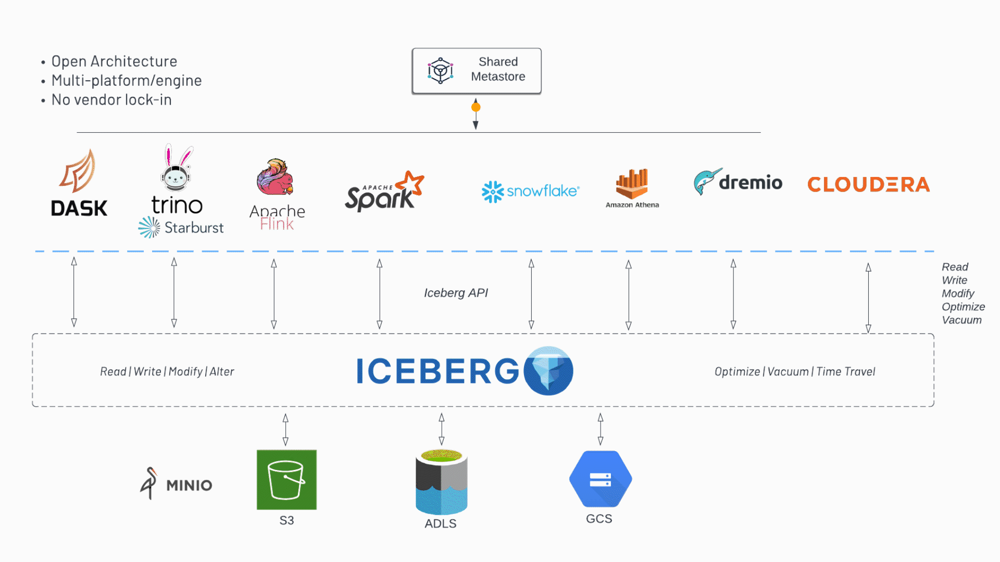
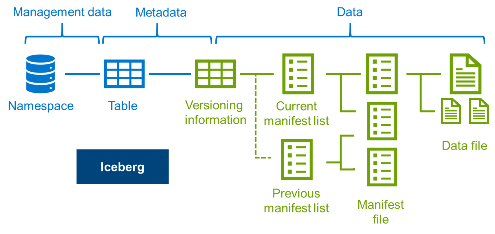
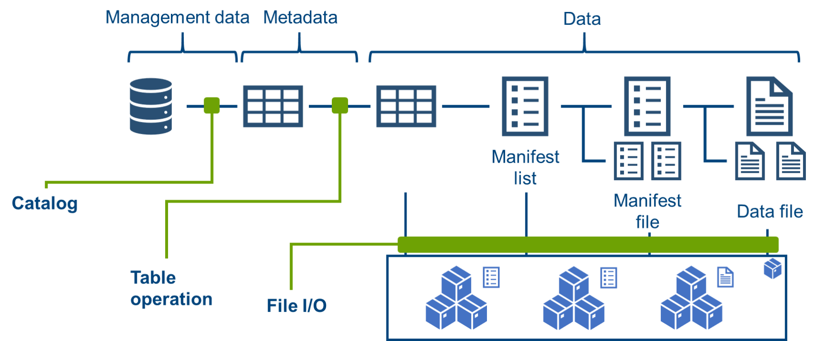
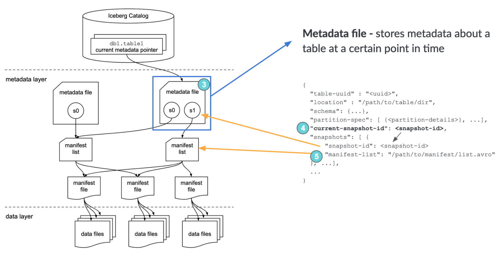
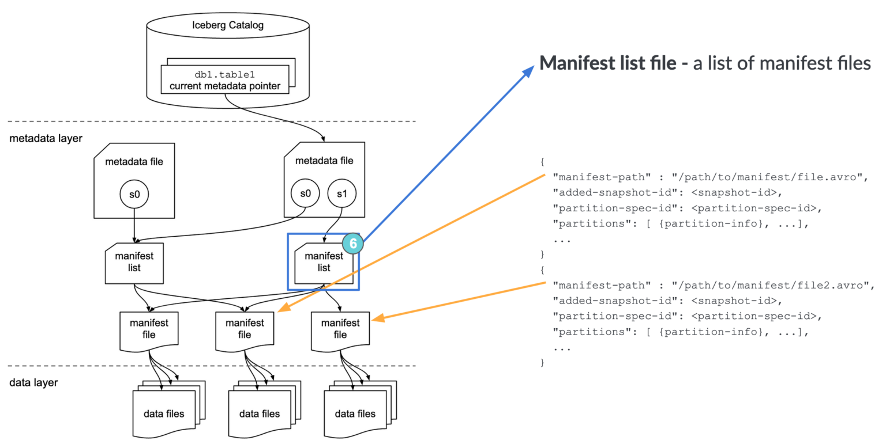
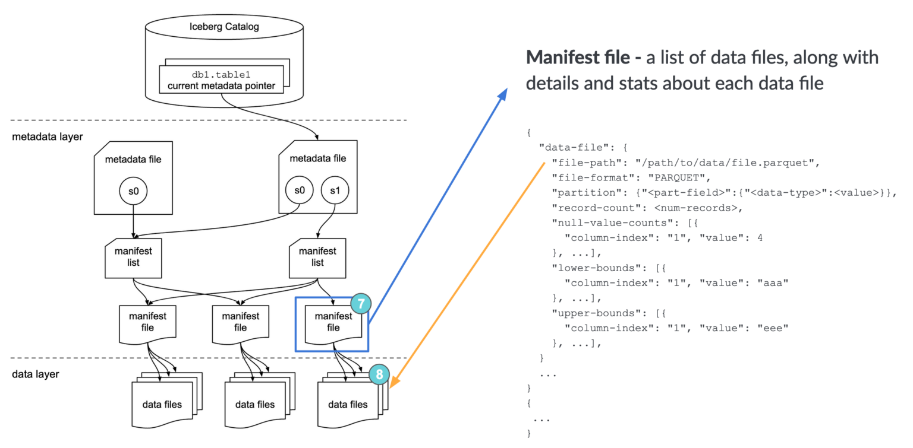

# Apache Iceberg

<!-- vim-markdown-toc GFM -->

* [Brief description](#brief-description)
* [Licensing / pricing model](#licensing--pricing-model)
* [Project Maturity](#project-maturity)
  * [Open Format Specification](#open-format-specification)
  * [Java Libraries](#java-libraries)
  * [Pyiceberg](#pyiceberg)
* [What Are the Goals of Iceberg?](#what-are-the-goals-of-iceberg)
  * [Serializable isolation](#serializable-isolation)
  * [Speed](#speed)
  * [Scale](#scale)
  * [Evolution](#evolution)
  * [Dependable Types](#dependable-types)
  * [Storage Separation](#storage-separation)
  * [Formats](#formats)
* [Main components](#main-components)
  * [Catalog Service](#catalog-service)
  * [Iceberg Table Specification](#iceberg-table-specification)
    * [Metadata file](#metadata-file)
    * [Snapshots](#snapshots)
    * [Manifest List](#manifest-list)
    * [Manifest File](#manifest-file)
* [Integrations](#integrations)
  * [Spark](#spark)
    * [Structured streaming](#structured-streaming)
    * [Catalog](#catalog)
  * [Hive](#hive)
* [Comparison with other data lake filesystems](#comparison-with-other-data-lake-filesystems)
  * [Iceberg vs Delta](#iceberg-vs-delta)
    * [Maturity](#maturity)
    * [Unique to Iceberg](#unique-to-iceberg)
      * [Concurrent Writes to Same Table](#concurrent-writes-to-same-table)
      * [Partition Layout Evolution](#partition-layout-evolution)
      * [Event listeners](#event-listeners)
    * [Common to Both](#common-to-both)
      * [ACID transactions](#acid-transactions)
    * [Time Travel/Version Rollback](#time-travelversion-rollback)
* [Limitations](#limitations)
  * [Performance](#performance)
* [Starting simple](#starting-simple)
* [Scalable Production](#scalable-production)

<!-- vim-markdown-toc -->

## Brief description

> Iceberg is a high-performance format for huge analytic tables. Iceberg brings the reliability and simplicity of SQL tables to big data, while making it possible for engines like Spark, Trino, Flink, Presto, Hive and Impala to safely work with the same tables, at the same time.

Essentially Iceberg has three components, all versioned separately:
* Open format specification[^1] for a table level persistence store
* Java API Layer & Reference implementation for interacting with the format specification, and integrating with processing engines (in-tree: Spark, Flink & Hive)
* Python API layer & CLI to interact with the Catalog server (or its Glue/Hive/DynamoDB equivalent (?)), and direct querying of the metadata/data layers

Iceberg is not[^6]:
* A storage engine
* An execution engine
* A service

Other processing engines have their own out-of-tree integrations with Iceberg (AWS Glue, Presto, Trino, Impala). Snowflake have released support for Iceberg Tables as a open-standard alternative to their proprietary table format to [public preview](https://www.snowflake.com/blog/iceberg-tables-powering-open-standards-with-snowflake-innovations/).

## Licensing / pricing model

Originally developed by Netflix, released to the public domain in 2017, donated to Apache Foundation in 2018. Released under the [Apache License 2.0](https://github.com/apache/iceberg/blob/master/LICENSE)

## Project Maturity

### Open Format Specification

Version 1 and 2 of the format specification have been completed and adopted by the community. The two releases see to be additive in scope.

### Java Libraries

Apache Iceberg v1.0 was released in November 2022.

### Pyiceberg

Pyiceberg is versioned separately despite being part of the Iceberg git repository, and is yet to have a major release (version 0.13 at time of writing).

## What Are the Goals of Iceberg?

### Serializable isolation

> Reads will be isolated from concurrent writes and always use a committed snapshot of a table’s data. Writes will support removing and adding files in a single operation and are never partially visible. Readers will not acquire locks.

Essentially what this means in practice is that, Iceberg supports writes to (immutable) files in the directory structure of the data layer without the contents being registered in the table entity. Iceberg terms this Optimistic Concurrency; any table data or metadata is created optimistically assuming that the current "version" will not be changed before that write is committed. In the case of multiple concurrent writes, the first to win the race succeeds, all others have to be retried.

When the write is committed, the table state is changed (i.e. the new data files previously written are registered against the tables) a new (immutable) metadata file is created, and the pointer held by the catalog service is swapped atomically.

> An atomic swap of one table metadata file for another provides the basis for serializable isolation. Readers use the snapshot that was current when they load the table metadata and are not affected by changes until they refresh and pick up a new metadata location.

If the metadata (or specifically the list of snapshots, see the next section for more detail) is no longer concurrent (i.e. does not have the same state as the one fetched when the write began) at point of commit, the writer process must recalculate the new metadata state against the current version, and try to commit this change again. How difficult this is depends on the change being written, and the isolation level which it requires, and is out of scope of this article.

The success of concurrent write operations also depends on the isolation level in a table. Apache Iceberg supports two isolation levels: serializable and snapshot. By default, the isolation level is serializable but can be changed to snapshot.

> “While serializable is the strongest isolation level in databases, snapshot isolation is beneficial for environments with many concurrent writers. The serializable isolation level guarantees that an ongoing UPDATE/DELETE/MERGE operation fails if a concurrent transaction commits a new file that might contain rows matching the condition used in UPDATE/DELETE/MERGE. For example, if there is an ongoing update on a subset of rows and a concurrent transaction adds a new file with records that potentially match the update condition, the update operation must fail under the serializable isolation but can still commit under the snapshot isolation.”

### Speed

> Operations will use O(1) remote calls to plan the files for a scan and not O(n) where n grows with the size of the table, like the number of partitions or files.

The metadata files I mentioned earlier contain all metadata relating to the table schema, partitioning config, custom properties, and snapshots (i.e. table states) of the table contents. This means that a single source of truth is maintained for query planning.

### Scale

> Job planning will be handled primarily by clients and not bottleneck on a central metadata store. Metadata will include information needed for cost-based optimization.

This point is already mostly covered with what I've said above; the metadata required for query planning is referenced by a pointer to a metadata file in the object store, the onus is on clients to use this for query planning before submission of the query to whatever distributed compute is available.

### Evolution

> Tables will support full schema and partition spec evolution. Schema evolution supports safe column add, drop, reorder and rename, including in nested structures.

Schema in this context is the table schema, the names and types of field stored in a table. Importantly, the relationship between tables and schemas is one-to-many, i.e. a table is described by an iterable of schemas. When a new schema is added, this evolution process copies the previous schema, applies the changes, and adds this (immutable) schema to the list of schemas recorded against the table. This gives a full history of how the table structure has evolved over time.

See [Storage Separation](#storage-separation) for more information on partition evolution.

### Dependable Types

> Tables will provide well-defined and dependable support for a core set of types.

Iceberg fields can be of primitive type (type wrapper around commonly used Avro/Parquet/Orc primitive types), or can be of struct type (immutable tuple of fields, think of it as a typed dict with metadata around default value/nullability/comments). Iceberg has its own types and its own mappings between these types and the types of the underlying (Avro/Parquet/ORC) representation.

### Storage Separation

> Partitioning will be table configuration. Reads will be planned using predicates on data values, not partition values. Tables will support evolving partition schemes.

Partitions are referenced by the top-level table metadata entity (Iceberg calls this a Specification), which also refers to the schemas iterable I mentioned previously. Partitions are applied against a data file, and what's different about Icebergs approach to partitioning is that the partition can represent the result of a transform applied to the data, instead of being limited to the data itself. This can be used to store the result of common filter operations against the data to avoid recomputing.
<!-- recomputing the values of common operations if that operation has a partition stored against its outputs.  -->

Importantly this means that new partitions can be added without the overhead of adding new fields solely for demarcating partitions, and without the need for querying a partition column explicitly. For example if you have a timestamp column you want to partition by month, you can add a column against a transform that extracts the month from that column rather than needing to extract the month into its own partition column, and utilize the partitioning when querying the timestamp column directly rather than needing to incorporating the extracted month column into the query explicitly. This ability to utilize partitions without knowing their exact structure is what Iceberg calls Hidden Partitioning[^4].

These partition transforms can evolve with time to become more granular whilst still being applicable to the previous use case. The partitioning scheme of a table to be changed without requiring a rewrite of the table; the old data will follow the old partition, new data will follow the new partition, and Iceberg will be made aware in order to plan queries appropriately.
Queries can be optimized using multiple partitions schemes (data partitioned using different schemes will be planned separately to maximize performance).

### Formats

> Underlying data file formats will support identical schema evolution rules and types. Both read-optimized and write-optimized formats will be available.

Iceberg operates on top of a distributed file system with data (Avro, Parquet & ORC) and metadata (Avro) stored in common open formats. Iceberg maps its own built-in types to theirs.

## Main components

We can characterize the position of Iceberg within a data engineering stack with the following graphic 

Starting from the top, a job is planned within some compute engine that requires data in iceberg, the compute then queries iceberg catalog via the relevant adapter, uses current metadata to plan and execute against the relevant data files provided.

Going down a level, we can see in the following graphic how this planning process goes from table-space to a list of references to relevant data files. 

And we can see in the final graphic how these entities are operated on is detailed in the follow graphic 

### Catalog Service

Iceberg supports a variety of Catalog implementations:

* REST Catalog
* JDBC Catalog
* Hive Catalog
* Spark Catalog
* AWS Glue Catalog[^3]
* DynamoDb Catalog
* Nessie Catalog

The essential requirement for a catalog is that it must support atomic transactions to properly execute atomic Iceberg table commits and read serializable isolation.[^5]

Each non-native implementation has its own integration which wraps it, but regardless of the implementation, the role of the catalog service is to provide the single-source-of-truth for metadata state; managing namespaces, partitioning, and updates to table state.

The REST is the only native implementation that does not require an external integration. At time of writing there is no service artefact produced for the REST catalog, only Java libraries which require wrapping in a web server (see [here](https://github.com/tabular-io/iceberg-rest-image/blob/master/src/main/java/org/apache/iceberg/rest/RESTCatalogServer.java) for an example. It feels like the REST catalog isn't really the recommended implementation, although that's never said explicitly, and that the expectation is to use one of the other catalog integrations.


### Iceberg Table Specification

Iceberg was designed to run completely abstracted from physical storage using object storage. All locations are “explicit, immutable, and absolute” as defined in metadata

Let's review the different metadata entities from the above diagram:
[^6]
#### Metadata file



The metadata file (point 3 in the above diagram) is the single-source-of-truth for all metadata about the current table state. Whenever the state is mutated a new metadata file is written and the pointer within the Catalog swapped atomically. Among other things it contains a reference to the latest snaphot (point 4 in the above diagram) and the manifest list associated with that snapshot.

#### Snapshots

Defines the state of the table at some point, including all data files, and paritions. Each snapshot is defined by a metadata file known as a manifest list.


#### Manifest List



A manifest list file describes a snapshot, storing amongst other things references to the manifest files that each describe a subset of a snapshot. The manifest list containst summary stats about the row counts, data file counts, and partitions, but detailed information is stored in the manifest files.

#### Manifest File



The manifest file contains the references to the data files themselves, their format, and more detailed stats about each file, and the paritions that are applied to it.


## Integrations

### Spark

Iceberg features full support for the following spark APIs:
* `DataFrameWriterV2`
* `DataFrameReader`
* `DataStreamWriter`
* `DataStreamReader`
* `DataSourceV2`

#### Structured streaming

Iceberg supports both reading and writing Dataframes using Sparks native structured streaming API (`spark.readStream` and `spark.writeStream`) in analogy to Delta Live Tables. However, Iceberg doesn't yet include any explicit orchestration functionality for managing the resulting live tables. These streams are processed as microbatches similar to Databricks closed-source implementation.

#### Catalog

Iceberg supplies [two implementations](https://iceberg.apache.org/docs/latest/spark-configuration/#catalog-configuration) of catalogs that integrate directly with Spark:

* `org.apache.iceberg.spark.SparkCatalog`: supports a Hive Metastore or a Hadoop warehouse as a catalog
* `org.apache.iceberg.spark.SparkSessionCatalog`: adds support for Iceberg tables to Spark’s built-in catalog, and delegates to the built-in catalog for non-Iceberg tables

### Hive

Iceberg supports reading and writing Iceberg tables through [Hive](https://hive.apache.org) by using a [StorageHandler](https://cwiki.apache.org/confluence/display/Hive/StorageHandlers).

Hive support is rapidly evolving with recent 4.0 release candidates including Iceberg as a dependency, and coming close to supporting the complete Iceberg feature set.

## Comparison with other data lake filesystems

### Iceberg vs Delta

#### Maturity

There is a considerable difference in maturity between Iceberg and Delta. Arguably the functional scope of Iceberg is also larger, where the functional equivalents of Delta are part of the closed source Databricks ecosystem.

#### Unique to Iceberg

##### Concurrent Writes to Same Table

Iceberg supports concurrent writes to the same Delta table from multiple spark drivers natively, whereas Delta requires a [workaround using DynamoDB and explicit feature/version toggle on all LogStore writers](https://docs.delta.io/latest/delta-storage.html#-delta-storage-s3-multi-cluster)

##### Partition Layout Evolution

> Partition layout evolution can update the layout of a table as data volume or query patterns change

As described in [Storage Separation](#storage-separation) common query transformations can be implemented as partitions, reducing re-computation. Reading between the lines it feels like the goal is to have this as an adaptive component of Iceberg rather than relying on explicit implementation.

##### Event listeners

Iceberg has a framework that allows other services to be notified when an event occurs on an Iceberg table. Currently, this feature is in the early stages, and only an event when a table is scanned can be emitted. This framework, however, provides the ability for future capabilities, such as keeping caches, materialized views, and indexes in sync with the raw data.[^6]

#### Common to Both

##### ACID transactions

Iceberg provides ACID transactionality is provided via the atomic metadata file swap, optimistic concurrency locking, isolation levels, and durable commit semantics.

#### Time Travel/Version Rollback

In Iceberg both data and metadata files are immutable, with any row level deletes being stored as separate files rather than overwriting the immutable data file. Any data updates will result in a new snapshot on commit. Any metadata updates are done with incremental ordering so state at any one moment in time is unambiguous. Time travel is possible to any point in time that has a snapshot associated, as that snapshot contains direct references to the immutable data files known to Iceberg (i.e. reflected in the table state) at that point in time.

In contrast, Delta stores incremental data changes as a delta in a transaction log. Time travel starts from the current states and reverts the changes described by the transaction log until arriving at the desired state.

## Limitations

### Performance

As of 2022, Iceberg is being outperformed by Delta in the TPC-DS benchmark. These benchmarks were run against Iceberg and Delta, with Delta demonstrating 33% load performance improvement over Iceberg and between 1.1x and 24x the performance of Iceberg in query performance[^9]. Later benchmarking with updated configuration settings revised this to a 2-3x query performance differential in favour of Delta[^10].

## Starting simple

```shell
git clone https://github.com/apache/iceberg.git
cd docker-spark-iceberg
docker-compose up
```

This simple example gives us four services.
* minio
* mc
* spark-iceberg
* rest

`minio` is a containerized object storage service with S3 protocol (specifically AWS S3) compatibility. `mc` is a simple client operating on `minio`.

`rest` is an implementation of the Iceberg REST catalog (namely a thin wrapper around the Java Reference Implementation). Looking at the `docker-compose.yml`, we can see that it has environment variables parameterizing the S3 object store (in this case `minio`) used for data/metadata storage, as well as a Java path to the FileIO operator use to interface with the object store.

`spark-iceberg` contains:
* A Jupyter notebook interface
* A `spark` execution environment
* The `iceberg-spark-runtime`

As well as a URL connection client for accessing S3, AWS Cli, and vendor-specific spark runtime (I'm not sure this is included for any other reason than it's produced by the same company as this example).

This container is obviously doing way more than it should, but it's not a production example. It may be interesting to talk through exactly what it is doing though by running `docker-compose exec spark-iceberg ps -afuxww`

* Running an ipython server.
  * Notebooks will instantiate:
    * pyiceberg:
      * interact with `rest` to pull out metadata
      * to pull out data to Apache Arrow/DuckDB.
    * pyspark shell:
      * to connect to the spark core
      * initialize spark context
      * provide API for job control in python space
* Running a spark:
  * Master
  * Worker
  * History Server
* Running a Hive Thrift Server (presumably the catalog implementation)

If we were to load a table from Iceberg using pyspark from an ipython notebook (e.g. `spark.table("demo.nyc.taxis")`, what would be happening?

Let's work through it with the data we have in hand, that is the HTTP logs of the `minio` bucket (`docker-compose exec mc mc admin trace minio`)

1. Spark requests current metadata from the Iceberg REST catalog via HTTP
2. Iceberg REST catalog requests, loads and parses current metadata state from S3
3. Iceberg populates HTTP response from metadata state, including link to current metadata snapshot (try it yourself `curl --location --request GET 'localhost:8181/v1/namespaces/nyc/tables/taxis?snapshots=all' --header 'Accept: application/json'`)
4. Spark loads metadata snapshot from S3, including metadata manifest files and their respective partitions
5. Spark loads manifests from S3, which contain links to the data files and sufficient information that Spark only needs to perform a partial read to load the data it's interested in.
6. Spark has sufficient information to devise a logical and physical plan, and pass the job(s) off for execution.
7. If an update to table state is to be performed, spark writes out the new metadata relating to that table state, then notifies Iceberg REST catalog to attempt a commit.
8. If this commit is successful, Iceberg REST catalog will refresh table metadata and update its pointer to the latest metadata state. If not, the onus is on spark to retry the commit.

If you're interested in learning more, there are a couple of blogs that take a similar file-centric view of Iceberg queries[^7][^8]

## Scalable Production

Iceberg documents a potential production setup using [AWS](https://github.com/apache/iceberg/blob/master/docs/aws.md)

[^1]: [Apache Iceberg Spec](https://iceberg.apache.org/spec/)

[^2]: [Lakehouse Architecture with Iceberg and MinIO (by MinIO)](https://blog.min.io/lakehouse-architecture-iceberg-minio/)
[^3]: [AWS Glue native Iceberg interface documentation](https://docs.aws.amazon.com/glue/latest/dg/aws-glue-programming-etl-format-iceberg.html)
[^4]: [Hidden Partitioning, by dremio](https://www.dremio.com/blog/fewer-accidental-full-table-scans-brought-to-you-by-apache-icebergs-hidden-partitioning/)
[^5]: [ACID compliance in Iceberg, by Snowflake](https://medium.com/snowflake/how-apache-iceberg-enables-acid-compliance-for-data-lakes-9069ae783b60)
[^6]: [Apache Iceberg: An Architectural Look Under the Covers, by dremio](https://www.dremio.com/resources/guides/apache-iceberg-an-architectural-look-under-the-covers/)
[^7]: [The Life of a Read Query for Apache Iceberg Tables, by dremio](https://www.dremio.com/blog/the-life-of-a-read-query-for-apache-iceberg-tables/)
[^8]: [A Hands-On Look at the Structure of an Apache Iceberg Table](https://www.dremio.com/blog/a-hands-on-look-at-the-structure-of-an-apache-iceberg-table/)

[^9]: [2022 Delta vs Iceberg Benchmarking](https://databeans-blogs.medium.com/delta-vs-iceberg-performance-as-a-decisive-criteria-add7bcdde03d)
[^10]: [2023 Delta vs Iceberg vs Hudi Benchmarking](https://www.onehouse.ai/blog/apache-hudi-vs-delta-lake-vs-apache-iceberg-lakehouse-feature-comparison)
