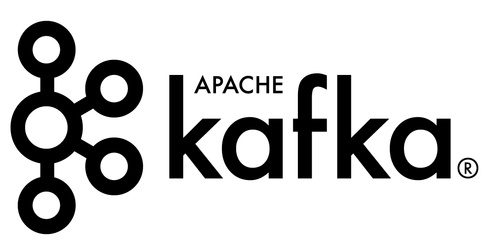
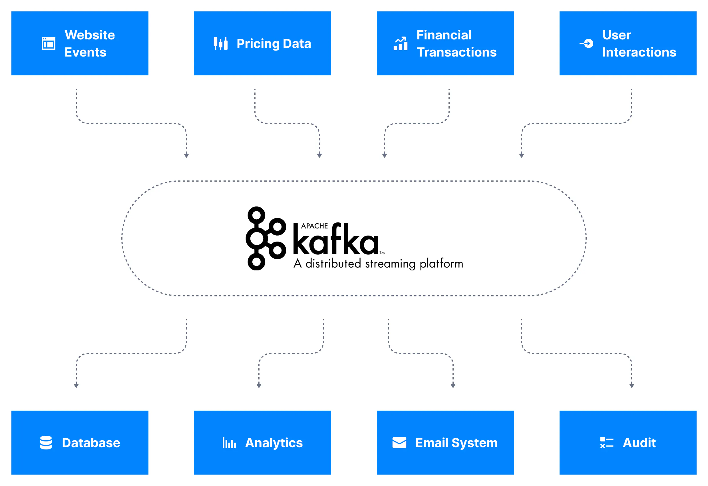
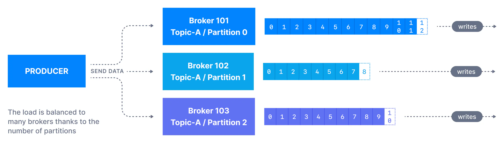
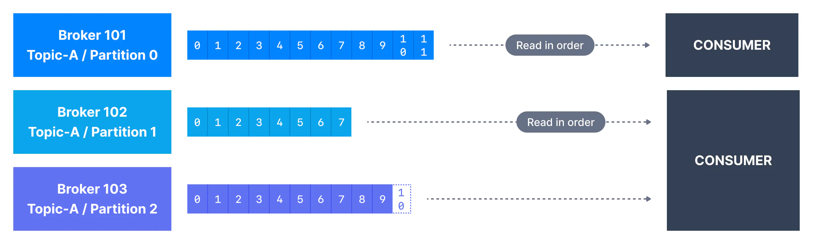
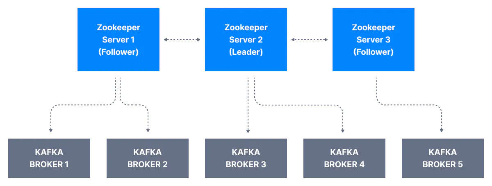
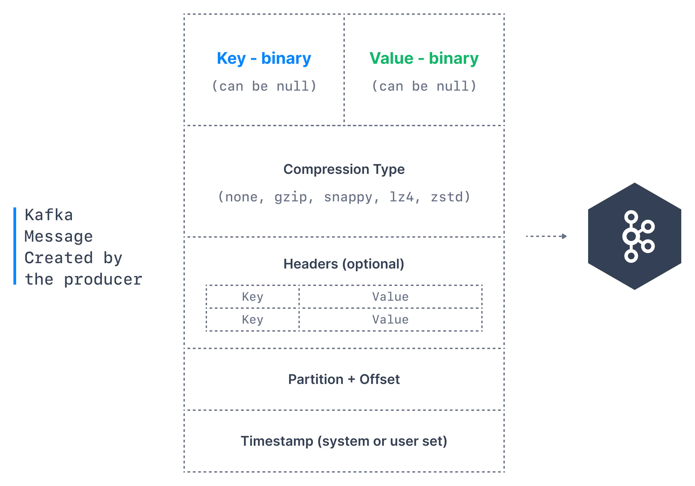

<!-- vim-markdown-toc GFM -->
- [Brief Description](#brief-description)
- [Goals](#goals)
- [Main Components of Kafka](#main-components-of-kafka)
    - [Kafka's Architecture](#kafkas-architecture)
- [Comparison with Other Event Streaming Technologies](#comparison-with-other-event-streaming-technologies)
- [Limitations](#limitations)
- [Local development](#local-development)
    - [Setting up a Local Kafka Environment](#setting-up-a-local-kafka-environment)
- [Kafka in Production](#kafka-in-production)
- [Further learning and reference material](#further-learning-and-reference-material)

<!-- vim-markdown-toc -->

## Brief Description
Apache Kafka is an open-source stream-processing software platform developed by the Apache Software Foundation, written in Scala and Java. It is a framework for storing, reading, and analyzing streaming data. Originally designed for tracking service calls and operational metrics at LinkedIn, it's evolved into a full-fledged event streaming platform, fundamentally changing how companies process real-time data.

## Goals
The primary goals are as follows:

1. **High Throughput:** Designed to handle a high volume of data, processing millions of messages per second.

2. **Scalability:** By scaling horizontally Kafka handles more data by adding more servers in the Kafka cluster.

3. **Fault Tolerance:** Resilient to node failures within the cluster through data replication, ensuring that data is not lost even if some servers fail.

4. **Low Latency:** Optimized for low latency to enable real-time processing and analytics of data streams.

5. **Durability:** Uses a distributed commit log ensuring that data is permanently stored and can withstand server failures.

6. **Versatility:** Designed to be a central platform for real-time data feeds. Its use cases include stream processing, website activity tracking, metrics collection, log aggregation, fraud detection, I could go on.

## Main Components of Kafka
Kafka consists of several key components:

1. **Producer:** Producers are clients that publish data (messages) to Topics.

2. **Broker:** Brokers form the core of the system, storing data, and serving client requests. Each broker can handle a large number of reads and writes per second and many thousands of clients simultaneously.

3. **Topic:** A topic is a category or feed name to which records are published. Topics in Kafka are always multi-subscriber.

4. **Partition:** Topics may be divided into partitions for better scalability and parallel processing. Partitions allow messages to be parallelized by splitting the data across multiple brokers.

1. **Consumer:** Consumers read data from the Brokers, they subscribe to one or more topics and process the data stream.

1. **Zookeeper:** Zookeeper is used to manage and coordinate the brokers. It is a consistent service for distributed systems that is used for maintaining configuration information, naming, providing distributed synchronization, and group services.

#### Kafka's Architecture
Kafka's architecture is built around a distributed commit log, A rough overview of the data flow is as follows:

1. **Producers push data to topics:** Producers create messages that are then pushed to topics. Each message consists of a key, a value, and a timestamp.

1. **Logs and partitions:** Topics are divided into a number of partitions, which contain logs. Each log is an ordered set of records. Partitioning allows Kafka to scale and supports multiple consumers by dividing the data across brokers.

2. **Consumers pull data from topics:** Consumers subscribe to one or more topics and pull data from the brokers. Consumer instances can be in different groups where each group gets a copy of the data, or within the same group to load balance data.

3. **Data replication for fault tolerance:** Kafka replicates data across multiple brokers and partitions to ensure fault tolerance. This replication is key to it's high availability and durability.

4. **Zookeeper for cluster coordination:** Zookeeper manages the cluster configuration and is used for leader election for partitions.

## Comparison with Other Event Streaming Technologies
There are alternative event streaming technologies that offer similar functionality to Kafka. Some of the most popular ones are:

1. **RabbitMQ:** RabbitMQ is a traditional message broker that excels in message queuing. Unlike Kafka, which maintains a log and allows for replaying of messages, RabbitMQ focuses on point-to-point and publish-subscribe messaging patterns without a strong emphasis on log retention.

2. **Apache Pulsar:** Apache Pulsar also offers high-throughput and low-latency streaming but differs in its architecture. Pulsar separates serving and storage layers, allowing for independent scaling. Kafka provides a simpler architecture but with less flexibility in some aspects.

3. **Kinesis:** Amazon Kinesis is a cloud-based event streaming platform. While Kinesis provides tight integration with AWS services and a managed solution, Kafka offers more flexibility and is not tied to a specific cloud provider. Kafka also tends to have higher throughput capabilities compared to Kinesis.

4. **Apache Flink:** Apache Flink is not a message broker but a stream processing technology. While Kafka excels in data ingestion and storage, Flink is used for complex event processing on streams. They are often used together, with Kafka providing the data pipeline and Flink handling the processing.

## Limitations

1. **Complexity in Setup and Management:** Setting up and maintaining a cluster can be complex, requiring a good understanding of its internal workings. This complexity can be a barrier for smaller teams or projects with limited operational resources.

2. **Resource Intensive:** Kafka can be resource-intensive, especially in large-scale deployments. It requires a significant amount of memory and CPU, which can increase operational costs.

3. **Limited Built-In Query Capabilities:** Kafka does not offer extensive built-in data querying capabilities. It's primarily a pipeline for data movement, so complex queries or data transformations often require additional tools or integrations.

4. **Data Schema Evolution:** Managing schema evolution can be challenging. There are tools like Confluent Schema Registry which help, ensuring compatibility as data formats evolve requires careful planning and management.

5. **Message Ordering Guarantees:** Kafka guarantees order within a single partition, but across multiple partitions it does not. This can be an issue for use cases that require global ordering of messages.

6. **Dependence on Zookeeper:** Although newer versions are moving away from this dependency, traditionally, Kafka has been heavily reliant on Zookeeper for cluster coordination, which adds another layer to the infrastructure.

## Local development

#### Setting up a Local Kafka Environment
For devs looking to experiment with Kafka or develop applications locally, setting up a local environment can be finicky. Using instructions from Udemy's course (see references) I've published setup [instructions here](https://github.com/kalebsofer/kafka-demo/blob/master/setup/local-development.md). The repo also contains a [library of typical Kafka commands](https://github.com/kalebsofer/kafka-demo/blob/master/1-kafka-cli/0-kafka-topics.sh), for example how to create a topic, how to produce and consume messages, etc.

## Kafka in Production
In practice, the production Kafka environment differs significantly from a local setup:

1. **Clustered Environment:** In production, Kafka runs in a clustered environment, with multiple brokers for scalability and fault tolerance. This is different from the single-broker setup typically used in local development.

2. **Enhanced Security:** Production environments often implement security measures like SSL/TLS encryption, SASL/SCRAM authentication, and ACLs for authorization, which are not usually set up in local development.

3. **High Availability and Disaster Recovery:** Large organizations configure Kafka for high availability, including setting up multi-region clusters and disaster recovery plans, which goes beyond the scope of local development setups.

4. **Monitoring and Logging:** Tools like Prometheus, Grafana, and ELK stack are commonly used to monitor Kafka’s performance and troubleshoot issues.

5. **Data Volume and Throughput:** With larger data volumes and throughput, careful tuning of brokers, producers, and consumers is necessary for optimal performance.

6. **Maintenance and Upgrades:** Production systems require regular maintenance, including updates and upgrades, which must be performed with minimal downtime. This often involves advanced strategies like rolling upgrades.

7. **Data Schema Management:** For managing and evolving data schemas in production, tools like Confluent Schema Registry are often used, ensuring compatibility and consistency across different applications and services.

## Further learning and reference material
This article provides a brief overview of Apache Kafka and its main components. For a more in-depth look, check out the following resources:

- [Official Apache Kafka documentation](https://kafka.apache.org/documentation/)

- [Udemy course on Kafka](https://www.udemy.com/course/apache-kafka/) (I've found this useful for getting setup, personally I find documentation and free tutorials a better way to learn the theory).

- [Kafka: The Definitive Guide](https://onlineshop.oxfam.org.uk/kafka-the-definitive-guide-real-time-data-and-streaming-processing-at-scale/product/HD_301385905?pscid=ps_ggl_OOS+-+Performance+Max+-+ROAS+(Books)_&crm_event_code=20REUWWS08&gad_source=1&gclid=Cj0KCQiAyeWrBhDDARIsAGP1mWQ3fUkAOi0bI1TQo9Uyoo3kbrV69NFTI0DxTq6YMKZ71F5FMGEe9AoaAgj1EALw_wcB&gclsrc=aw.ds)

- The images used in this post are from the [Conduktor documentation](https://www.conduktor.io/kafka/what-is-apache-kafka/)