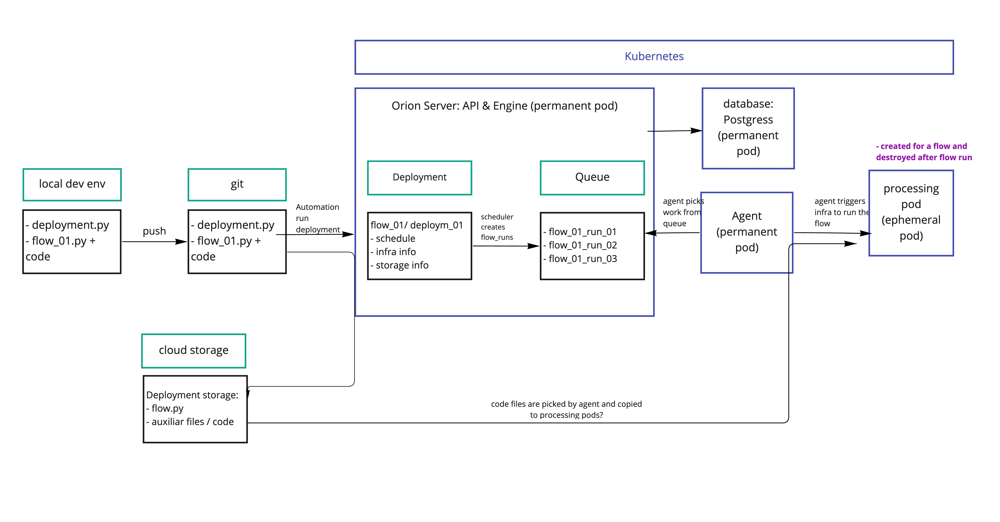

# Prefect

## Brief description
Prefect is a Python framework for tasks/pipelines orchestration. It's main selling points are:
- The setup can be as simple or as complex as needed, adapting to the needs of the work that it will orchestrate, for example: 
	- can be run in a single machine for very simple use cases
	- can be deployed as a robust service in a kubernetes cluster and trigger serverless cloud compute in most public clouds to process big data tasks
- Main concepts are very intuitive and easy to start using
- Little additional effort in writing code using the framework
- WebUI for pipeline monitoring, logging and alerting
- Is script based and integrates well with version control services (Github, Gitlab, etc)
- Having a good amount of ex-airflow developers in the community, it addresses several areas where Airflow is either showing its age or where commonly the framework or concepts add extra hassle to get things done. NoteL a interesting blog about this can be found here: https://medium.com/the-prefect-blog/why-not-airflow-4cfa423299c4

What were the main drives that led to Prefect version 2:
- some of the concepts were reviewed to make the tool more intuitive
- a broader range of use cases is now covered
- all functionality is now available in the open source / community version.

Which tools in the market deliver similar functionality to Prefect?
- Airflow
- Azure Data Factory
- AWS Step Functions
- Matilion

-------------

## Licensing / pricing model
Open-source version available can be run locally or on any infrastructure of choice (e.g., Docker, Kubernetes). There is a paid cloud hosted version that offers the orchestration server as managed service, with a ready to use access control feature. 

-------------

## Comparing with other orchestration tools

### Prefect x Airflow

- Starting to use Prefect feels simpler and more intuitive than Airflow. 
- Turning existing python code into workflows can be done with very little refactoring.
- Workflows can do nearly everything a python function can, which means they are not limited to directed acyclic processes and can easily exchange results between them (python returned data or objects).
- Prefect workflows can be triggered off-schedule (including starting more than one of the same flow in parallel and with the same start time) 
- Logs for flow runs are maintained even if never scheduled and just run manually.
- Dates: In prefect the schedule date is the flow start date (very intuitive), which is different from Airflow's confusing concept of "_end of an interval_ capped by the DAG’s start time".
- Prefects architecture is more modern and allows for more fully integrating with parallel processing and distributed systems. For example:
	- the tasks are scheduled by the flow runner and not by a centralised scheduler. 
	- Logs are written to the database also by runners instead of centralised. 
- This reduces bottleneck and allows to fully use potential of the workers infra-structure (for example, if using a Dask Cluster as runner one can benefit from millisecond scheduler)
- Both Airflow and Prefect can be used either as a pure orchestration tool or "orchestration + processing" tool depending on your needs and complexity of your architecture.
- Prefect doesn't have the equivalent of Airflow sensors, to make an event driven processing setup you can trigger runs via the prefect API.
- The Prefect web UI of the open source version doesn't come with an user access control interface ready to use (the cloud paid version does).

### Prefect x Azure Data Factory x AWS Step functions

- Prefect is a code-oriented orchestration tool, while Data Factory and Step Functions are no-code orchestration tools where the user builds their workflows via a visual interface.
- They are provided as cloud services specific to their respective vendors (ADF from Microsoft, and Step functions from AWS) and will require a complete rewrite of the workflows to another tool if moving between cloud providers is desired.
- The more usual setup for Step Functions is to have it as an orchestration tool, calling other services to do the processing (AWS lambda, AWS glue, etc).
- Data factory is also mostly used for orchestration only calling other services to process and transform data (Databricks, Azure Functions, Synapse, etc). In addition to these, ADF has its own managed spark processing engine (ADF Data Flow) that provides a low-code interface for most data processing transformations with easy integration.

When ADF or Step functions can be your preferred option instead of Prefect:
- both integrate more easily with all other services offered by their respective cloud providers. 
- very little maintenance because they are provided as services (saving the user from any infrastructure maintenance work)
- pipelines can be built and scheduled via No Code drag and drop UI instead of code.

### Prefect x Matilion

- Matilion is similar to Data Factory and Step functions in the fact that it provides a no-code visual interface to build workflows. 
- Its main focus is orchestrating data workflows. The usual setup is to have it deployed on top of a data warehouse solution (redshift, big query, delta lake, etc) to schedule and orchestrate pipelines processed by the warehouse engine.
- The matilion service can be run in different clouds and infrastructure (which makes it more portable than ADF and Step Functions). 
- The workflows can be version controlled and integrated to a git repository.
- If the processing engine used is proprietary and/or cloud specific (redshift, big query, etc) it may be rather complex to move between clouds.

-------------

## Main components

### Prefect Orion API server
 Orchestration engine: receives state information from workflows and provides flow run instructions for executing deployments.

### Prefect database
Provides a persistent metadata store that holds flow and task run history.

### Prefect UI
Provides a control plane for monitoring, configuring, analyzing, and coordinating runs of your workflows.

### Work queues
Runs in the server API, the flows are put in specified queues to be picked for execution by agent.

### Agents
run on the execution environment or from an infrastructure capable of setting/triggering an execution environment (e.g. creating a docker container for execution or a k8s pod). They pick up flows from the work queue and pass them to the execution infrastructure (note: in the simplest setup where the infrastructure option is “process” the agent executes the code in a process in the same box where the agent itself is running, but for most production use cases this is not the best setup).

-------------

## Starting simple

Some aspects make prefect very easy to start using:
 - All components can be run locally or in a single container (useful for very light weight use-cases or dev)
 - Very little refactoring is needed to turn python code into pipelines (basically adding function decorators @flow and @task)
 - Easy to run locally for dev / testing.
 - Moving a pipeline from a basic setup to a more scalable production one is possible by simply changing the API endpoint and re-deploying it.

-------------

## Scalable Production

The two main ways to scale prefect horizontally are:
- Have your flows executed in a Dask/Ray cluster (if fast startup times are important for your job you can consider keeping a cluster running and manage its size according to need).
- Have each of your flows executed in a new kubernetes pod and the k8s cluster managed to scale according to need.

-------------

## Draft of a deployment design
An example of what a Kubernetes scalable deployment could look like:  

-------------

## Working examples:
 1) a very basic deployment in a single container can be found in the zipped_examples:
	 - prefect_toy_single_container_example.zip
 1) a docker-compose example using a more realistic setup can be found in the zipped examples: 
	 - prefect_with_docker_compose_example.zip

-------------

## Core concepts

### flow
Abstraction for the high-level unit of the thing we are orchestrating (similar to: pipeline, DAG in other tools). It can call as steps: other flows or tasks (smaller unit). In practice you create a flow by decorating a python function with @flow and you can benefit straight away of:
-   State transitions are reported to the API, allowing observation of flow execution.
-   Input arguments types can be validated.
-   Retries can be performed on failure.
-   Timeouts can be enforced to prevent unintentional, long-running workflows.

### flow run
One specific execution of a flow

### deployment
I personally find this concept's name a bit confusing because it can generate ambiguity as the deployment refers not to the resulting artefact of deploying Prefect (infra/etc) but to the result of deploying a flow to the server API. To avoid this ambiguity you can think of **deployment** as the **deployed flow**.
In prefect you have to make the server aware about the existence of a flow you created in order to fully benefit from scheduling, UI and orchestration capabilities. Making the server aware is to **deploy** the flow. If you change anything to the flow you should deploy it again. Each instance that was deployed is called a deployment. Once deployed the code for a flow is also stored in storage.

### task
Tasks are the abstraction for the lower-level unit of work. All tasks must be called from within a flow. Tasks may not be called from other tasks. You use the @task decorator to designate a function as a task. 

Task results are cached in memory during execution of your flow run and persisted to the location specified by the PREFECT_LOCAL_STORAGE_PATH setting. This means results are available within the context of flow run and task retries use these results. However, task caching between flow runs is currently limited to flow runs with access to that local storage path.

Tasks receive metadata about upstream dependencies and the state of those dependencies before they run, even if they don't receive any explicit data inputs from them. This gives you the opportunity to, for example, have a task wait on the completion of another task before executing.

### task run
One specific execution of a task

### states
States are rich objects that contain information about the status of a particular task run or flow run. 

If you run your task as a python function (e.g. function(parameters)) you will receive as a return only the normal Python returned object, if you want to receive a state add the parameter return_state=True to your task call. The original python returned object can then be retrieved via "state.result()" .

Ideally you should not call your tasks as normal python functions, but instead with "function.submit(parameters)" this way you can benefit from task runner's concurrent / parallel processing. When you do so, you also get as return to your task execution a prefect future (that includes a state object and the usual python returned)

to get the python object from the future use "future.result()"
to get the state from the prefect future use "future.wait()"

### prefect future
Represents the result of a computation happening in a task runner.

future.get_state() - gets the present state of a task / flow
future.result() - waits for completion and gets the data / obj returned by the task / flow
future.wait() - waits for completion and gets the final state

### infrastructure
Users may specify an infrastructure block when creating a deployment. This block will be used to specify infrastructure for flow runs created by the deployment at runtime.

Infrastructure can only be used with a deployment. When you run a flow directly by calling the flow yourself, you are responsible for the environment in which the flow executes.

Prefect uses infrastructure to create the environment for a user's flow to execute.

Infrastructure is attached to a deployment and is propagated to flow runs created for that deployment. Infrastructure is deserialized by the agent and it has two jobs:

- Create an execution environment infrastructure for the flow run.
- Run a Python command to start the prefect.engine in the infrastructure, which retrieves the flow from storage and executes the flow.

The engine acquires and calls the flow. Infrastructure doesn't know anything about how the flow is stored, it's just passing a flow run ID to the engine.

Infrastructure is specific to the environments in which flows will run. 

Prefect currently provides the following infrastructure types:

- **Process** runs flows in a local subprocess.
- **DockerContainer** runs flows in a Docker container.
- **KubernetesJob** runs flows in a Kubernetes Job.
- **ECSTask** runs flows in an ECS Task.

What about tasks?

Flows and tasks can both use configuration objects to manage the environment in which code runs. Flows use infrastructure. Tasks use task runners. For more on how task runners work, see Task Runners.

### task runners

Calling a task function from within a flow, using the default task settings, executes the function sequentially. Execution of the task function blocks execution of the flow until the task completes. This means, by default, calling multiple tasks in a flow causes them to run in order.

You can use the .submit() method on a task function to submit the task to a task runner. Using a task runner enables you to control whether tasks run sequentially, concurrently, or if you want to take advantage of a parallel or distributed execution library such as Dask or Ray.

Each flow can only have a single task runner, but sometimes you may want a subset of your tasks to run using a specific task runner. In this case, you can create subflows for tasks that need to use a different task runner.

Prefect currently supports:
- **SequentialTaskRunner** 
- **ConcurrentTaskRunner** 
- **DaskTaskRunner** 
- **RayTaskRunner** 

### storage
Storage lets you configure how flow code for deployments is persisted and retrieved by Prefect agents. Anytime you build a deployment, a storage block is used to upload the entire directory containing your workflow code (along with supporting files) to its configured location. This helps ensure portability of your relative imports, configuration files, and more. Note that your environment dependencies (for example, external Python packages) still need to be managed separately.

If no storage is explicitly configured, Prefect will use LocalFileSystem storage by default. Local storage works fine for many local flow run scenarios, especially when testing and getting started. However, due to the inherent lack of portability, many use cases are better served by using remote storage such as S3 or Google Cloud Storage.

### blocks
Blocks are a primitive within Prefect that enable the storage of configuration and provide an interface for interacting with external systems.

Blocks are useful for configuration that needs to be shared across flow runs and between flows. For configuration that will change between flow runs, we recommend using parameters.

With blocks, you are able to securely store credentials for authenticating with services like AWS, GitHub, Slack, or any other system you'd like to orchestrate with Prefect. Blocks also expose methods that provide pre-built functionality for performing actions against an external system. Blocks can be used to download data from or upload data to an S3 bucket, query data from or write data to a database, or send a message to a Slack channel.

### filesystems
A filesystem block is an object that allows you to read and write data from paths. Prefect provides multiple built-in file system types that cover a wide range of use cases.

- LocalFileSystem
- RemoteFileSystem
- Azure
- GitHub
- GCS
- S3
- SMB

### schedules
Schedules tell the Prefect API how to create new flow runs for you automatically on a specified cadence.

You can add a schedule to any flow deployment. The Prefect `Scheduler` service periodically reviews every deployment and creates new flow runs according to the schedule configured for the deployment.
They can be created via the UI or specified in your flow deployment.

### scheduler service
The Scheduler service is started automatically when prefect orion start is run and it is a built-in service of Prefect Cloud. By default, the Scheduler service visits deployments on a 60-second loop and attempts to create up to 100 scheduled flow runs up to 100 days in the future. 

These defaults can be shown with the terminal command: 

	prefect config view --show-defaults

### database
The Prefect Orion database persists data used by many features of Prefect to persist and track the state of your flow runs, including:
- Flow and task state
- Run history
- Logs
- Deployments
- Flow and task run concurrency limits
- Storage blocks for flow and task results
- Work queue configuration and status

Currently Prefect Orion supports the following databases:
- SQLite: The default in Prefect Orion, and our recommendation for lightweight, single-server deployments. SQLite requires essentially no setup.
- PostgreSQL: Best for connecting to external databases, but does require additional setup (such as Docker). Prefect Orion uses the pg_trgm extension, so it must be installed and enabled.

## Reference:

- https://docs.prefect.io/concepts/overview/ (website)
- https://discourse.prefect.io/ (community forum)
- https://medium.com/the-prefect-blog (blog)
- https://github.com/prefecthq/prefect-helm (helm charts of K8s)
- https://www.prefect.io/guide/blog/introducing-prefect-2-0/ (intro to prefect v2)
- https://docs-v1.prefect.io/core/about_prefect/why-not-airflow.html#the-scheduler-service (comparing with Airflow - prefect biased)

interesting examples:
- https://rdrn.me/scaling-out-prefect/ (old, prefect v1, but interesting production setup)
- https://github.com/fraibacas/prefect-orion (docker-compose deployment)
- https://medium.com/the-prefect-blog/serverless-real-time-data-pipelines-on-aws-with-prefect-ecs-and-github-actions-1737c80da3f5 (using prefect cloud but could be used as starting point to similar one using self hosted prefect server)
- https://github.com/tekumara/orion-demo (deployment with several kubernetes examples )
